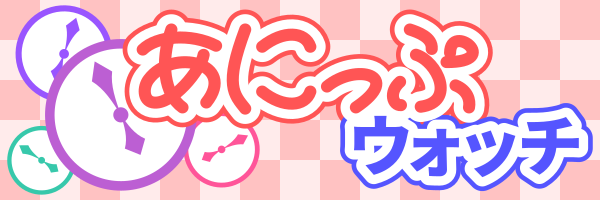
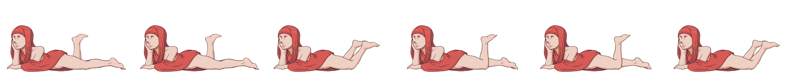
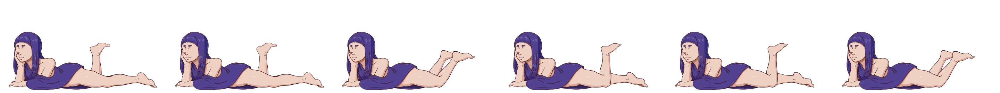
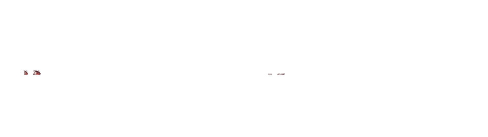
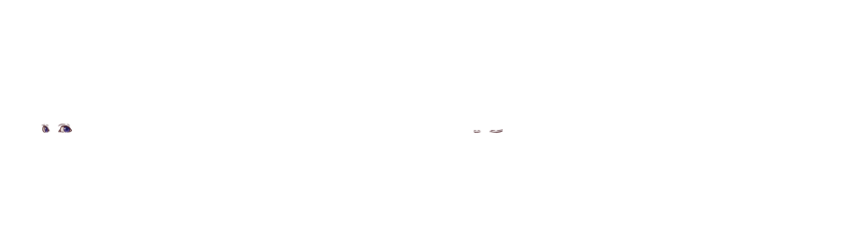

Anipwatch (あにっぷウォッチ)
============================




Index
-----

- [Description](#descrioption)
- [LICENSE](#license)
- [Logo and Icon](#logo-and-icon)
- [Usage](#usage)
- [Settings file](#settings-file)
- [Textures](#textures)
- [Run example](#run-example)

Description
-----------

Very lovely clock and stopwatch.
It always places on the top of desktop and animates pictures.

LICENSE {#license}
------------------

- Software: MIT License
- Logo and icon: [CC BY 4.0](https://creativecommons.org/licenses/by/4.0/)
- Images in examples: [CC BY-SA 4.0](https://creativecommons.org/licenses/by-sa/4.0/)

Logo and Icon
-------------

- Logo: [`logo.png`](logo.png)
- Icon: [`src/icon.png`](src/icon.png)

Usage
-----

Runs Anipwatch.

```bash
anipwatch /path/to/settings_file.yaml
```

Shows help.

```bash
anipwatch --help

# or

anipwatch -h
```

Settings file
-------------

See [example](examples/example_settings.yaml).

Defines main window size

```yaml
window_size:
    width: 480
    height: 270
```

Specifies save data file path.  
Root of the path is a directory that settings file is placed in.

```yaml
save_data_file: "save_file.data"
```

Defines texture names and specifies their file paths.  
Root of the path is a directory that settings file is placed in.

```yaml
textures:
    -
        name: "display"
        path: "display.png"
    -
        name: "body_texture_white"
        path: "body_texture_white.png"
    -
        name: "eyes_texture_white"
        path: "eyes_texture_white.png"
    -
        name: "body_texture_red"
        path: "body_texture_red.png"
    -
        name: "eyes_texture_red"
        path: "eyes_texture_red.png"
    -
        name: "body_texture_blue"
        path: "body_texture_blue.png"
    -
        name: "eyes_texture_blue"
        path: "eyes_texture_blue.png"
    -
        name: "numbers"
        path: "numbers.png"
    -
        name: "switch_btn"
        path: "switch_btn.png"
    -
        name: "start_stop_btn"
        path: "start_stop_btn.png"
    -
        name: "reset_btn"
        path: "reset_btn.png"
    -
        name: "quit_btn"
        path: "quit_btn.png"
```

Defines skins.

- `skins: []` : An array of skins.
    - `name: "skin name"` : Defines skin name.
    - `display: ` : Specifies where numbers are placed on.
        - `texture_name: "texture_name"` : Texture name of numbers.
        - `depth: 0` : `0` means the forefront of textures. The more this number, the more the texture goes deeply.
        - `regions: ` : Specifies where each number is placed on.
            - `centiseconds: ` : Specifies centiseconds.
                - `d1: ` : The 1st digit.
                    - `x: 440.0` : X-coordinate of this number.
                    - `y: 0.0` : Y-coordinate of this number.
                    - `width: 40.0` : Width of this number.
                    - `height: 60.0` : Height of this number.
                - `d2: ` : The 2nd digit.
            - `seconds: ` : Specifies seconds.
            - `minutes: ` : Specifies minutes.
            - `hours: ` : Specifies hours.
    - `switch_button: ` : Clock / Stopwatch toggle button.
        - `texture_name: "texture_name"` : Texture name of this button.
        - `depth: 0` : `0` means the forefront of textures. The more this number, the more the texture goes deeply.
        - `regions: ` : Specifies where this button is placed on.
            - `x: 440.0` : X-coordinate of this button.
            - `y: 0.0` : Y-coordinate of this button.
            - `width: 40.0` : Width of this button.
            - `height: 60.0` : Height of this button.
        - `start_stop_button: ` : Start / Stop button of stopwatch.
        - `reset_button: ` : Reset button of stopwatch.
        - `quit_button: ` : Quit button of Anipwatch.
        - `aimations: []` : An array of animation pictures.
            - `texture_name: "texture_name"` : Texture name of this picture.
            - `depth: 0` : `0` means the forefront of textures. The more this number, the more the texture goes deeply.
        - `regions: ` : Specifies where this picture is placed on.
            - `x: 440.0` : X-coordinate of this button.
            - `y: 0.0` : Y-coordinate of this button.
            - `width: 40.0` : Width of this button.
            - `height: 60.0` : Height of this button.
        - `frames: 1` : Number of frames.
        - `fps: 1.0` : Frames per seconds.
        - `probability: 0.5` : Probability of whether or not to execute an animation. It is drawn every second when the animation is stopped. __(Optional)__

```yaml
skins:
    -
        name: "skin_white"
        display:
            texture_name: "numbers"
            depth: 0
            regions:
                centiseconds:
                    d1:
                        x: 440.0
                        y: 0.0
                        width: 40.0
                        height: 60.0
                    d2:
                        x: 400.0
                        y: 0.0
                        width: 40.0
                        height: 60.0
                seconds:
                    d1:
                        x: 340.0
                        y: 0.0
                        width: 40.0
                        height: 60.0
                    d2:
                        x: 300.0
                        y: 0.0
                        width: 40.0
                        height: 60.0
                minutes:
                    d1:
                        x: 240.0
                        y: 0.0
                        width: 40.0
                        height: 60.0
                    d2:
                        x: 200.0
                        y: 0.0
                        width: 40.0
                        height: 60.0
                hours:
                    d1:
                        x: 140.0
                        y: 0.0
                        width: 40.0
                        height: 60.0
                    d2:
                        x: 100.0
                        y: 0.0
                        width: 40.0
                        height: 60.0
        switch_button:
            texture_name: "switch_btn"
            depth: 2
            region:
                x: 100.0
                y: 60.0
                width: 95.0
                height: 20.0
        start_stop_button:
            texture_name: "start_stop_btn"
            depth: 3
            region:
                x: 195.0
                y: 60.0
                width: 95.0
                height: 20.0
        reset_button:
            texture_name: "reset_btn"
            depth: 4
            region:
                x: 290.0
                y: 60.0
                width: 95.0
                height: 20.0
        quit_button:
            texture_name: "quit_btn"
            depth: 5
            region:
                x: 385.0
                y: 60.0
                width: 95.0
                height: 20.0
        animations:
            -
                texture_name: "display"
                depth: 1
                region:
                    x: 100.0
                    y: 0.0
                    width: 380.0
                    height: 60.0
                frames: 1
                fps: 1.0
            -
                texture_name: "body_texture_white"
                depth: 7
                region:
                    x: 0.0
                    y: 0.0
                    width: 480.0
                    height: 270.0
                frames: 6
                fps: 2.0
            -
                texture_name: "eyes_texture_white"
                depth: 6
                region:
                    x: 0.0
                    y: 0.0
                    width: 480.0
                    height: 270.0
                frames: 2
                fps: 2.0
                probability: 0.5
    -
        name: "skin_red"
        display:
            texture_name: "numbers"
            depth: 0
            regions:
                centiseconds:
                    d1:
                        x: 440.0
                        y: 0.0
                        width: 40.0
                        height: 60.0
                    d2:
                        x: 400.0
                        y: 0.0
                        width: 40.0
                        height: 60.0
                seconds:
                    d1:
                        x: 340.0
                        y: 0.0
                        width: 40.0
                        height: 60.0
                    d2:
                        x: 300.0
                        y: 0.0
                        width: 40.0
                        height: 60.0
                minutes:
                    d1:
                        x: 240.0
                        y: 0.0
                        width: 40.0
                        height: 60.0
                    d2:
                        x: 200.0
                        y: 0.0
                        width: 40.0
                        height: 60.0
                hours:
                    d1:
                        x: 140.0
                        y: 0.0
                        width: 40.0
                        height: 60.0
                    d2:
                        x: 100.0
                        y: 0.0
                        width: 40.0
                        height: 60.0
        switch_button:
            texture_name: "switch_btn"
            depth: 2
            region:
                x: 100.0
                y: 60.0
                width: 95.0
                height: 20.0
        start_stop_button:
            texture_name: "start_stop_btn"
            depth: 3
            region:
                x: 195.0
                y: 60.0
                width: 95.0
                height: 20.0
        reset_button:
            texture_name: "reset_btn"
            depth: 4
            region:
                x: 290.0
                y: 60.0
                width: 95.0
                height: 20.0
        quit_button:
            texture_name: "quit_btn"
            depth: 5
            region:
                x: 385.0
                y: 60.0
                width: 95.0
                height: 20.0
        animations:
            -
                texture_name: "display"
                depth: 1
                region:
                    x: 100.0
                    y: 0.0
                    width: 380.0
                    height: 60.0
                frames: 1
                fps: 1.0
            -
                texture_name: "body_texture_red"
                depth: 7
                region:
                    x: 0.0
                    y: 0.0
                    width: 480.0
                    height: 270.0
                frames: 6
                fps: 2.0
            -
                texture_name: "eyes_texture_red"
                depth: 6
                region:
                    x: 0.0
                    y: 0.0
                    width: 480.0
                    height: 270.0
                frames: 2
                fps: 2.0
                probability: 0.5
    -
        name: "skin_blue"
        display:
            texture_name: "numbers"
            depth: 0
            regions:
                centiseconds:
                    d1:
                        x: 440.0
                        y: 0.0
                        width: 40.0
                        height: 60.0
                    d2:
                        x: 400.0
                        y: 0.0
                        width: 40.0
                        height: 60.0
                seconds:
                    d1:
                        x: 340.0
                        y: 0.0
                        width: 40.0
                        height: 60.0
                    d2:
                        x: 300.0
                        y: 0.0
                        width: 40.0
                        height: 60.0
                minutes:
                    d1:
                        x: 240.0
                        y: 0.0
                        width: 40.0
                        height: 60.0
                    d2:
                        x: 200.0
                        y: 0.0
                        width: 40.0
                        height: 60.0
                hours:
                    d1:
                        x: 140.0
                        y: 0.0
                        width: 40.0
                        height: 60.0
                    d2:
                        x: 100.0
                        y: 0.0
                        width: 40.0
                        height: 60.0
        switch_button:
            texture_name: "switch_btn"
            depth: 2
            region:
                x: 100.0
                y: 60.0
                width: 95.0
                height: 20.0
        start_stop_button:
            texture_name: "start_stop_btn"
            depth: 3
            region:
                x: 195.0
                y: 60.0
                width: 95.0
                height: 20.0
        reset_button:
            texture_name: "reset_btn"
            depth: 4
            region:
                x: 290.0
                y: 60.0
                width: 95.0
                height: 20.0
        quit_button:
            texture_name: "quit_btn"
            depth: 5
            region:
                x: 385.0
                y: 60.0
                width: 95.0
                height: 20.0
        animations:
            -
                texture_name: "display"
                depth: 1
                region:
                    x: 100.0
                    y: 0.0
                    width: 380.0
                    height: 60.0
                frames: 1
                fps: 1.0
            -
                texture_name: "body_texture_blue"
                depth: 7
                region:
                    x: 0.0
                    y: 0.0
                    width: 480.0
                    height: 270.0
                frames: 6
                fps: 2.0
            -
                texture_name: "eyes_texture_blue"
                depth: 6
                region:
                    x: 0.0
                    y: 0.0
                    width: 480.0
                    height: 270.0
                frames: 2
                fps: 2.0
                probability: 0.5
```

Specifies default mode.  
- `clock` : Clock mode.
- `stopwatch` : Stopwatch mode.

```yaml
default_mode: "clock"
```

Specifies default skin name of stopwatch mode.

```yaml
default_stopwatch_skin_name: "skin_white"
```

Specifies default skin name of clock mode.

```yaml
default_clock_skin_name: "skin_white"
```

Defines events to change skin on stopwatch mode.

- `stopwatch_events: []` : An array of events.
    - `skin_name: "skin_name"` : Skin name.
    - `from: ` : Specifies time when to change skin.
        - `centiseconds: 0` : Centiseconds. [0, 99]
        - `seconds: 30` : seconds. [0, 59]
        - `minutes: 0` : minutes. [0, 59]
        - `hours: 0` : hours. [0, 99]

```yaml
stopwatch_events:
    -
        skin_name: "skin_red"
        from:
            centiseconds: 0
            seconds: 30
            minutes: 0
            hours: 0
    -
        skin_name: "skin_blue"
        from:
            centiseconds: 0
            seconds: 0
            minutes: 1
            hours: 0
    -
        skin_name: "skin_white"
        from:
            centiseconds: 0
            seconds: 30
            minutes: 1
            hours: 0
```

Defines events to change skin on clock mode.

- `clock_events: []` : An array of events.
    - `skin_name: "skin_name"` : Skin name.
    - `from: ` : Specifies time when to change skin.
        - `centiseconds: 0` : Centiseconds. [0, 99]
        - `seconds: 0` : seconds. [0, 59]
        - `minutes: 0` : minutes. [0, 59]
        - `hours: 8` : hours. [0, 23]

```yaml
clock_events:
    -
        skin_name: "skin_red"
        from:
            centiseconds: 0
            seconds: 0
            minutes: 0
            hours: 8
    -
        skin_name: "skin_blue"
        from:
            centiseconds: 0
            seconds: 0
            minutes: 1
            hours: 16
```

Textures
--------

At least, PNG and JPEG are supported.

### Numbers

Line up same size pictures from 0 to 9 from left to right.


### Switch button

'stopwatch mode to clock mode' button is placed left. (shows in stopwatch mode)  
'clock mode to stopwatch mode' button is placed left. (shows in clock mode)


### Other buttons

Each Other button is simple picture.

Start and stop button,


Reset button,


Quit button,


### Animation pictures

Line up same size pictures from the 1st frame to the last frame from left to right.











Run example
-----------

Change current working directory to `examples` and execute the following command.

```bash
cargo run --release -- example_settings.yaml
```
